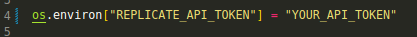

# 🤖 GPT-checkers

## 🤝 Autores:
* Artur Mendes de Moraes
* Elaine Dias Pires

## 🔎  Sobre
Este trabalho visa implementar uma partida de damas contra uma GPT. A GPT utilizada foi a "llama-2-13b-chat" da meta. Foi criada uma chave para realizar a comunicação com a API no seguinte link:
https://replicate.com/account/api-tokens


## 💻  Tecnologias utilizadas
O jogo de damas foi implementado em python utilizando a biblioteca pygame.


## 🎯 Rodando o jogo
Para conseguir executar o projeto, siga os passos abaixo:
* Faça o clone do repositório https://github.com/elainedias16/GPT-checkers.git 

* Instale o replicate 
```
$ pip install replicate
```
* Instale pygame
```
$ pip install pygame
```
* Insira sua api-key no arquivo server_replicate na linha 4 em:

* Na pasta root do projeto, execute o comando:
```
$ python3 main.py
```


